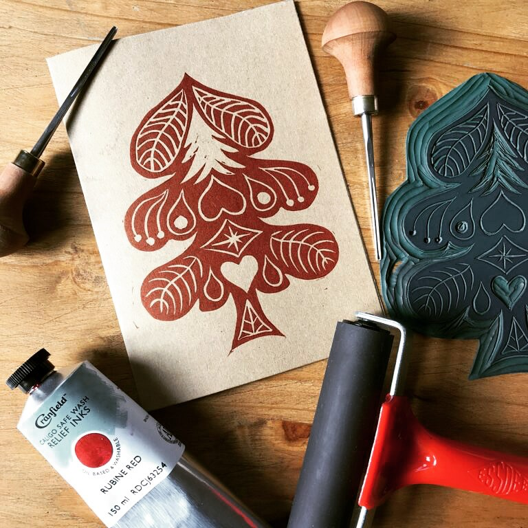
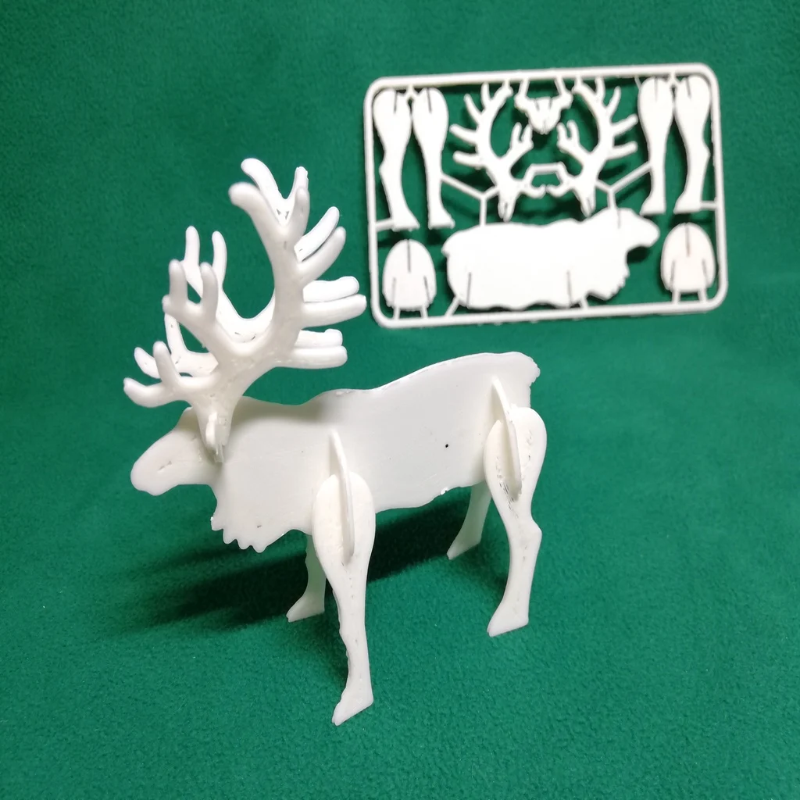
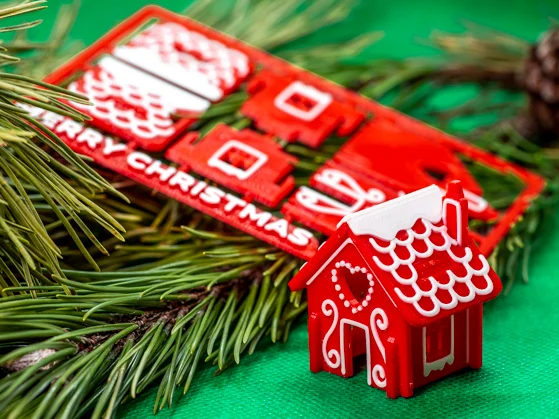
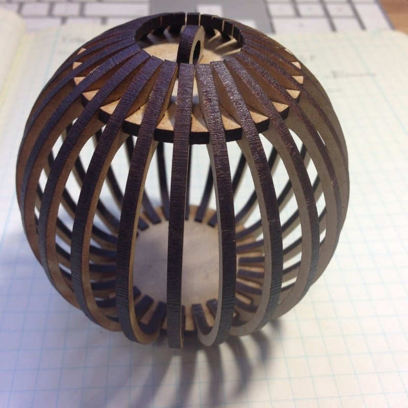

This repo contains all the files to support the laser cutter and 3D printer projects for the end-of-year winter giftmaking workshop. We also included some extra files/projects to adapt and personalise.

      

# Laser Cuts

## Official Projects:
- [`./LaserCuts/AdventHouse.svg`](./LaserCuts/AdventHouse.svg) - Laser Cut Personalised Gingerbread House
- [`./LaserCuts/BouleOrnament.svg`](./LaserCuts/BouleOrnament.svg) - Laser Cut Christmas Tree Ball

## Extras:
- [`./LaserCuts/FlexibleXmasTreeOrnaments.svg`](./LaserCuts/FlexibleXmasTreeOrnaments.svg)
- [`./LaserCuts/MailablePineTree.svg`](./LaserCuts/MailablePineTree.svg)
- [`./LaserCuts/SpiralXmasTree-noInscription.svg`](./LaserCuts/SpiralXmasTree-noInscription.svg)
- [`./LaserCuts/StarWarsChristmasBall.svg`](./LaserCuts/StarWarsChristmasBall.svg)
- [`./LaserCuts/TreetopDeathStar.svg`](./LaserCuts/TreetopDeathStar.svg)

# 3D Prints

## Official Projects:
- [`./3DPrints/Reindeer_card_reorganized_V3.stl`](./3DPrints/Reindeer_card_reorganized_V3.stl) - Reindeer Card Kit (w/ optional sleigh)
- [`./3DPrints/Gingerbread_Kit_A.stl`](./3DPrints/Gingerbread_Kit_A.stl) - Gingerbread House Card Kit A
- [`./3DPrints/Gingerbread_Kit_B.stl`](./3DPrints/Gingerbread_Kit_B.stl) - Gingerbread House Card Kit B
- [`./3DPrints/Coin_Cell_LED_holder1.stl`](./3DPrints/Coin_Cell_LED_holder1.stl) - Lighting mount for the official laser cutter projects (option 1)
- [`./3DPrints/Coin_Cell_LED_holder2.stl`](./3DPrint

